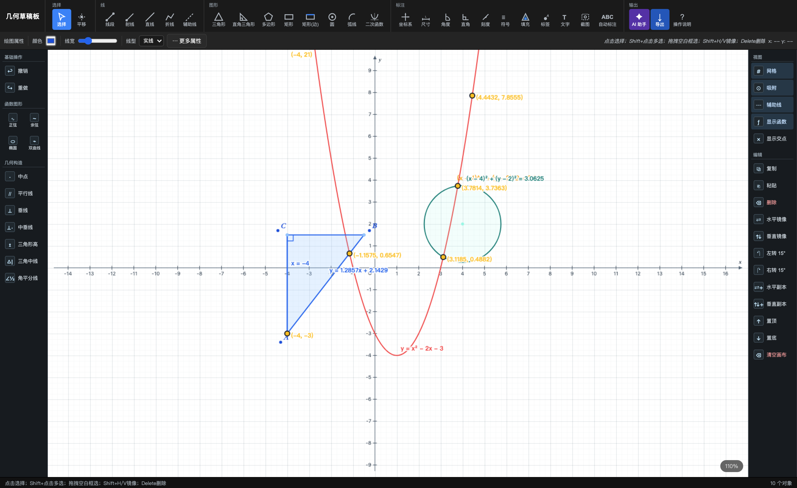
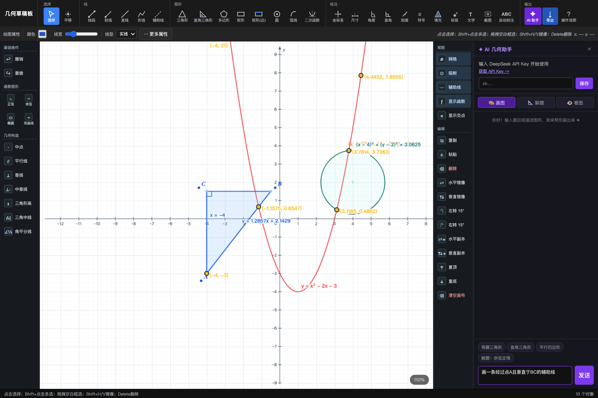
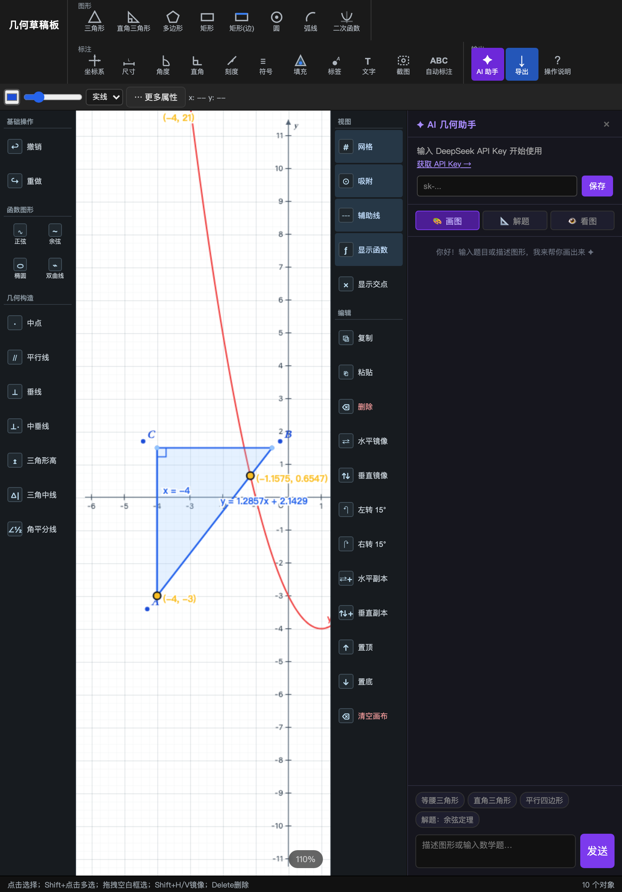

# Geometry Draft Board

Lightweight geometry sketch software for middle-school and high-school classrooms.

一个面向初中和高中数学课堂的轻量几何草稿板。它保留了 CAD 式的便利性，但尽量去掉复杂工程化操作，重点服务学生和老师的课堂草图、几何辅助作图、函数图像绘制和 AI 交互讲解。

Online demo: `https://sailing52188.github.io/geometry-draft-board/`

Repository: `https://github.com/sailing52188/geometry-draft-board`

Current version: `v1.0.0`

## Screenshots

### Desktop Workspace



### AI Assistant Panel



### iPad Layout



## Why This Project

### 中文

- 不追求 AutoCAD 的完整度，追求课堂草稿的效率。
- 核心绘图命令尽量可见，减少藏在二级菜单里的操作。
- 优先覆盖中学数学高频图形、函数与辅助构造。
- 让 AI 和画布联通，但不把基础几何绘图能力绑死在 AI 上。

### English

- Built for speed in teaching and learning, not for full CAD complexity.
- Keeps core drawing actions visible instead of hiding them behind deep menus.
- Focuses on common classroom geometry, function graphs, and guided constructions.
- Connects AI with the canvas without making the core drawing workflow depend on AI.

## Main Features

### 中文

- 顶部和侧边分类命令栏，核心工具不隐藏。
- 几何工具：线段、射线、折线、多边形、三角形、直角三角形、矩形、圆、圆弧、角标、尺寸标注。
- 坐标与函数：直线、二次函数、正弦、余弦、椭圆、双曲线。
- 方程与交点：可显示函数解析式，自动计算交点坐标。
- 智能吸附：端点、交点、坐标轴、整数刻度、函数曲线、平行、垂直、中点等。
- 精确定点：可通过输入 `(x, y)` 进行坐标定点。
- 多端交互：兼容 macOS `Cmd`、Windows `Ctrl` 快捷键和 iPad 触控。
- AI 助手：支持文字画图、几何解题、看图分析。

### English

- Categorized top and side command rails with always-visible core tools.
- Geometry tools for lines, rays, polygons, triangles, right triangles, rectangles, circles, arcs, angle marks, and dimensions.
- Coordinate and graph support for lines, quadratics, sine, cosine, ellipses, and hyperbolas.
- Equation display and local intersection solving.
- Smart snapping for endpoints, intersections, axes, integer ticks, function curves, and geometric relations.
- Exact coordinate point entry for precise classroom constructions.
- macOS, Windows, and iPad-friendly interaction model.
- AI assistant for draw-from-text, step-by-step solving, and canvas-aware analysis.

## Quick Start

### Open Directly

Double-click `index.html` or drag it into any modern browser.

双击 `index.html`，或直接拖入现代浏览器即可运行。

### Run Locally

```bash
npm install
npm test
npm run check:syntax
npm run serve
```

Then open `http://127.0.0.1:8765/`.

## Releases And Downloads

- Source code download: GitHub repository `Code` menu
- Tagged release download: GitHub `Releases`
- Local packaged archive: release asset `geometry-draft-board-v1.0.0.zip`

## AI Key Storage

- The AI integration uses DeepSeek by default.
- The API key is entered manually by the user.
- The key is only stored in the current browser's `localStorage`.
- Sharing the project files or the GitHub repository does not share your real key.
- If no key is configured, the non-AI geometry and graphing features still work.

## Project Structure

- `index.html`: single-file application with UI, canvas rendering, and interactions
- `tests/geometry_ux_regression_test.js`: regression tests for geometry and UX behavior
- `scripts/check-syntax.js`: embedded script syntax checker
- `scripts/capture-screenshots.mjs`: reproducible screenshot generator
- `docs/feature-spec.md`: feature specification for the classroom drawing expansion
- `CHANGELOG.md`: public release history

## Development Commands

- `npm test`: run regression tests
- `npm run check:syntax`: validate the embedded script
- `npm run capture:screenshots`: regenerate README screenshots
- `npm run serve`: start a local static server

## License

MIT
